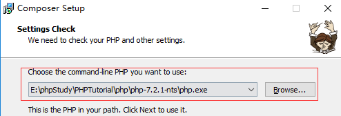
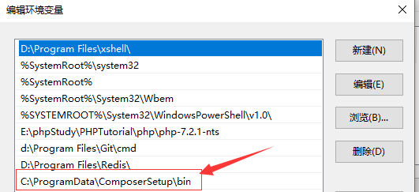
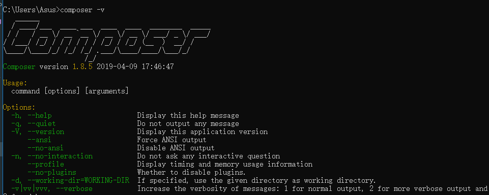

### 简述在Windows上使用composer

* composer官网地址
[composer官网](https://www.phpcomposer.com/)

在composer的官网上可以看到有如下几个分类

1. [首页](https://www.phpcomposer.com/)
2. [中国镜像](https://pkg.phpcomposer.com/)
3. [中文文档](http://docs.phpcomposer.com/)
4. [入门指南](http://docs.phpcomposer.com/00-intro.html)
5. [下载](https://getcomposer.org/download/)
6. [安装包列表](https://packagist.org/)

大体上就是这六类，首先接触composer的呢，可以大致浏览一下，它的每个分类，作为一个php从业者，composer就是你的左手右臂，基本是
不可或缺的，平时以Windows开发为php为主的，希望这个文档可以帮到你。

大家都知道，在Windows上安装软件，首先是下载它的安装包，然后直接点击下一步，下一步就OK了。
这里就首先提供官网的下载地址。
[composer下载飞机票](https://getcomposer.org/Composer-Setup.exe)
点击之后可以直接下载。

1. 对于第一步下载来说是没什么问题的，第二个问题就是，下载完成之后的安装，安装composer之前，必须先安装PHP。就是说在你的机器上必须要
先把PHP安装好，这样才可以安装composer。

2. 所以这个第二部其实是和第一步相反的，我们必须先安装php,个人建议，在Windows上最好是装一个集成环境，也就是别人把换件给你放到一个包里，你直
接安装这个包就可以了，推荐[phpstudy](http://phpstudy.php.cn/index.php),这个属于纯粹的中文网站，基本一看就懂。

3. 这里点击下一步会出现如下的界面,我标记出来的就是PHP程序选择，如果你安装了PHP，而且在Windows上的环境变量也配置了，那么这个时候，是不需要
你的操作的，它会自动选择填充。很方便



4. 接下来就是一直下一步了。知道它告诉你安装完成。

5. 一般来说，这种安装包，它会自动给你配置环境变量的，为了保险起见，需要自己去看一看。
Windows上点到 此电脑-》右键属性 -》 左边菜单栏，选择高级系统设置 -》 选择下面的环境变量 -》 找到path,点击编辑 -》 可以看到如下界面



这台机器已经添加了，所以不需要添加，如果是没有添加，那么就需要找到，composer的安装目录，复制它的bin目录，然后点击添加，把它复制进去就可以了。

6. 验证composer是否安装成功，Windows+R 输入cmd,输入composer -V,显示如下界面代表成功



7. 需要修改composer的中国镜像，它的官方镜像有时会让你像蜗牛一样的爬行，所以这里我们需要把它的镜像修改为中国镜像，官方有推荐的如下：

7.1 修改全局的镜像

```composer log
composer config -g repo.packagist composer https://packagist.phpcomposer.com
```

7.2 修改当前项目的镜像,在当前下项目的composer.json文件修改或添加

```json
"repositories": {
    "packagist": {
        "type": "composer",
        "url": "https://packagist.phpcomposer.com"
    }
}
```

注意，官方推进的中国镜像，最近好像也是有问题的，所以个人推荐使用laravel中国镜像，把url修改为：

```composer log
https://packagist.laravel-china.org
```

**************

### 以上就是在Windows上安装composer的大概事项

平时做项目想要使用composer，就可以在里面搜索想要的轮子，然后下载就欧克了。比如下载PHP的框架laravel,打开cmd,输入
`composer create-project laravel/laravel`,就可以了。

[github地址，欢迎star](https://github.com/lijianguo1211/lijianguo/tree/phpmd)

