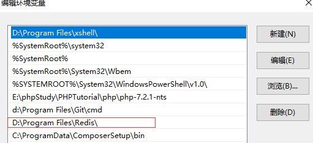
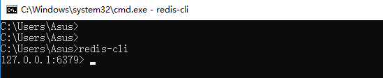
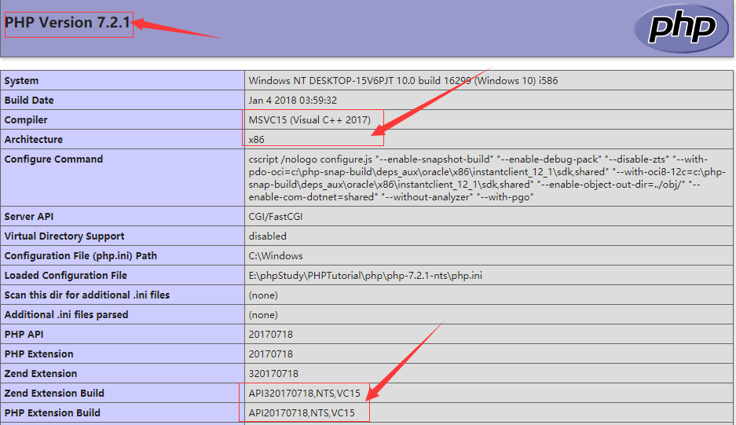
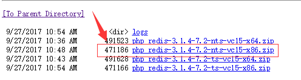
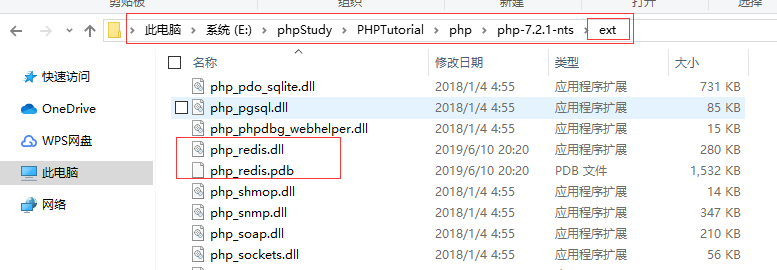
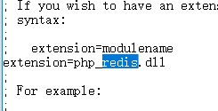
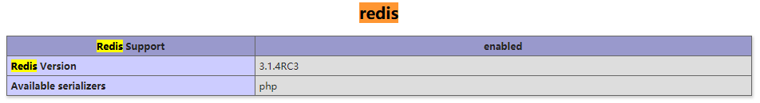

### windows 上redis安装以及PHP扩展redis的安装

* Windows上安装包下载地址[Redis](https://github.com/ServiceStack/redis-windows/tree/master/downloads)

下载需要的安装包，这个是zip格式的文件，也就是直接免安装，直接解压使用的，还有二进制安装包的形式，就是直接点击下一步安装的，有需要的可以自己去
搜索。二进制安装包的就是直接下一步下一步就可以，直到安装完成。

**安装完成之后，需要配置path环境变量**，如下：找到你的安装包所在路径，然后在path里添加即可。

windows+R键打开cmd。然后输入redis-cli。就可以看到redis的启动登陆后界面了：

> 这有一个前提就是，我们把redis服务放到Windows的开机自启动里面了，不然我们要使用的时候，就需要先启动redis-server服务，然后再打开一
个cmd窗口，之后再登陆

### PHP安装redis扩展

* ext-redis 扩展所在地址 [php-ext-redis](https://windows.php.net/downloads/pecl/snaps/redis/3.1.4/)

* 创建一个php文件，输出`echo phpinfo()`,这里是查看我们的PHP的版本以及是多少位的，还有是否是安全版本。最后根据这些信息来选择redis版本，如
下：

可以看到，这里是 **X86** **7.2**  **vc15**

对照就应该选择这个版本下载：

* 解压下载完成后的php扩展文件redis.然后找到我们的PHP的安装目录，这里有两个目录

1. PHP的扩展所在目录

2. PHP.ini文件所在目录

我们把redis的扩展文件放到ext文件，如下：

然后再php.ini文件开启扩展`extension=php_redis.dll`

* 最后再重启服务器，apache或者nginx,在浏览器上输出`phpinfo`;搜索一下redis.如下显示就代表成功

**************************************

以上就是Windows下安装redis,以及给PHP安装redis扩展

[github地址，欢迎大家一起学习](https://github.com/lijianguo1211/lijianguo/blob/phpmd/php/php_redis/redis-windows/redis%EF%BC%88%E4%B8%80%EF%BC%89.md)

